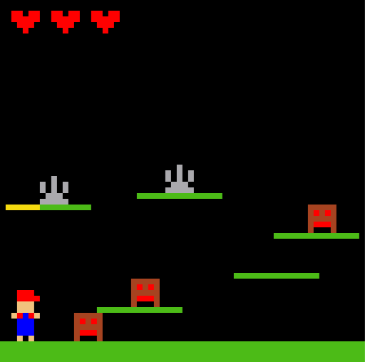

# Assembly Platform Game

> by Andrew Effendi © CSCB58 Project ~ April 2023

### Assembly Platform Game written for the MIPS processor. ###

### Game play setup walk through: ###
https://play.library.utoronto.ca/watch/abc87be52f016de511732f9e015c2841

### Bitmap Display Configuration: ###
- Unit width in pixels: 8
- Unit height in pixels: 8
- Display width in pixels: 512
- Display height in pixels: 512
- Base Address for Display: 0x10008000 ($gp)